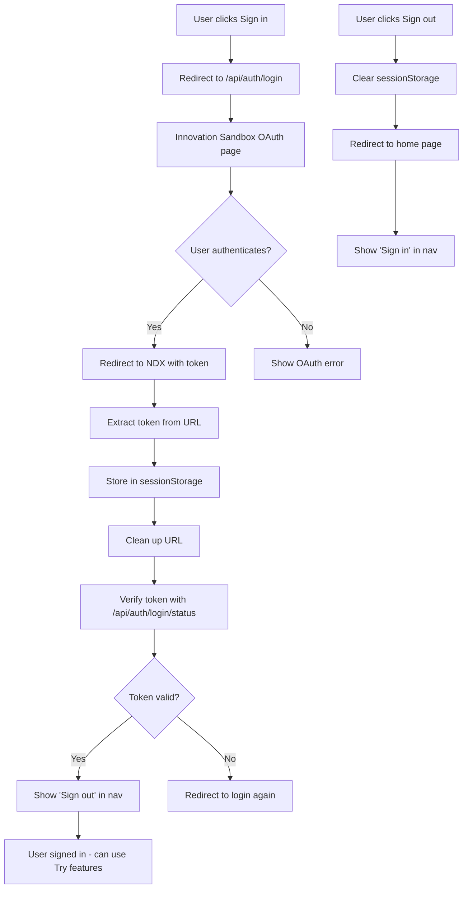
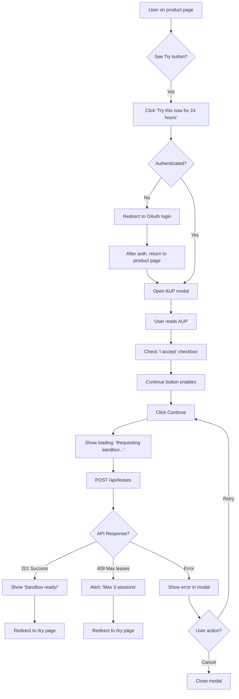

# NDX Try Before You Buy - UX Design Specification

_Created on 2025-11-22 by cns_
_Generated using BMad Method - Create UX Design Workflow v1.0_

---

## Executive Summary

This UX Design Specification defines the user experience for the NDX "Try Before You Buy" feature, enabling UK government users to request and access temporary AWS sandbox environments directly from the NDX catalogue.

**Feature:** AWS Innovation Sandbox Integration
**Platform:** Web (Eleventy static site with client-side JavaScript)
**Design System:** GOV.UK Frontend (already integrated)
**Accessibility Target:** WCAG 2.2 AA minimum, AAA where feasible
**Compliance:** GOV.UK Design System, GDS standards, government service requirements

---

## 1. Design System Foundation

### 1.1 Design System Choice

**System:** GOV.UK Frontend v5.x (via @x-govuk/govuk-eleventy-plugin 7.2.1)

**Rationale:**

- Already integrated into NDX platform
- Official UK government design system
- WCAG 2.1 AA accessibility built-in (upgrading to WCAG 2.2 for Try feature)
- Familiar to government users
- Comprehensive component library
- Maintained by Government Digital Service (GDS)

**Provides:**

- Buttons, forms, navigation, modals, tables
- Typography system (GDS Transport font)
- Color palette (GOV.UK brand colors)
- Spacing system (based on 4px grid)
- Responsive grid system
- Accessible components with ARIA labels

**Customization Needs for Try Feature:**

- Custom session table component (extends GOV.UK table)
- Custom AUP modal overlay (extends GOV.UK modal pattern)
- Custom status badges (color-coded with text labels)
- Custom authentication state indicators
- Custom loading states for async operations

---

## 2. Core User Experience

### 2.1 Project Vision

**Purpose:** Enable government users to evaluate AWS services hands-on before committing to procurement, reducing procurement cycle time from weeks to seconds.

**Target Users:**

- Government department technical staff evaluating cloud services
- Public sector organizations assessing AWS capabilities
- IT decision-makers needing hands-on validation before purchase
- Budget holders requiring informed procurement decisions

**Core Problem Solved:** Traditional government procurement requires contracts before access, creating barriers to informed decision-making. Try Before You Buy removes this friction.

**User Skill Level:** Expert (government technical staff with cloud knowledge)

---

## 2. Core User Experience

### 2.1 Defining Experience

**The Core Action:**
When someone describes the Try Before You Buy feature, they would say:

> "It's where you can get instant 24-hour access to AWS services to test them before procurement - no contracts, no delays, just click and try."

**The ONE Experience That Defines This Feature:**
**Request a 24-hour AWS sandbox in < 30 seconds** - from catalogue product page to AWS Console access.

**User Flow Breakdown:**

1. **Discovery:** Browse NDX catalogue → Identify AWS service → See "Try Before You Buy" tag and button
2. **Decision:** Click "Try this now for 24 hours" → Sign in (if needed) → Read and accept AUP
3. **Access:** Request processed → Navigate to /try page → Launch AWS Console via SSO portal
4. **Management:** View active/past sessions → Monitor budget/time → Terminate early if needed

**Effortless Experience Requirements:**

- **Try button click:** Immediate, obvious, no hesitation about what happens next
- **AUP acceptance:** Quick to scan, clear what you're agreeing to, but ensures reading (not just click-through)
- **Session management:** One-click launch to AWS Console, clear status indicators
- **Entire flow:** Friction-free from start to finish - no confusion, no delays, no unclear states

**Most Critical User Action: AUP Acceptance in Modal**

This is the most important UX moment because:

- **Legal requirement:** Users must understand they're accepting terms for AWS resource usage
- **Risk:** Users might skip reading and click "Accept" immediately (government accountability requires informed consent)
- **Balance needed:** Make it easy to scan and understand, but ensure actual reading happens
- **Government context:** Public sector users need to know budget limits ($50), time limits (24 hours), acceptable use

**UX Challenge:** Design the AUP modal to encourage reading without creating friction that abandons the flow.

**Platform Consideration: Mobile Equally Important**

Mobile experience must support:

- **Full try flow:** Browse catalogue → Try button → AUP acceptance → Request sandbox (not desktop-only)
- **Session management:** View active/past sessions, check budget, launch AWS Console
- **Responsive tables:** Sessions table must work on phone screens (stacked cards or horizontal scroll)
- **Modal adaptation:** AUP modal must be readable and scrollable on small screens
- **Touch targets:** All buttons meet minimum touch target size (44x44px minimum)

**Rationale:** Government staff work on tablets/phones in the field, at meetings, on-the-go. Limiting mobile to "view only" would create friction.

### 2.2 Desired Emotional Response

**Primary Feeling: Confident and Trusted**

When government users interact with Try Before You Buy, they should first and foremost feel:

> "This is official, government-approved, safe, and compliant. I can use this without worry about budget overruns, security issues, or procurement violations."

**Why Trust-First Matters:**

- **Government accountability:** Public sector users need confidence this is an official, approved service
- **Budget sensitivity:** Taxpayer money requires transparent, controlled spending ($50 limit, 24-hour limit)
- **Compliance requirements:** Users must know this meets GDS standards, WCAG accessibility, security requirements
- **Career protection:** Government staff need assurance using this won't create audit issues or policy violations

**Supporting Feelings (in priority order):**

**1. Efficient and productive**

- "This saves me weeks of procurement delays"
- Fast, streamlined, removes bureaucratic friction
- Users should feel their time is respected

**2. Empowered and in control**

- "I can self-service without waiting for approvals"
- Autonomous access to evaluation tools
- Clear transparency into session status, budget, time remaining

**3. Calm and focused**

- "This is straightforward and predictable"
- No confusion about what's happening or what to do next
- Can concentrate on evaluating AWS services, not fighting the interface

**Design Implications:**

**Trust signals throughout:**

- Prominent GOV.UK Design System branding (official government service)
- Clear budget limits displayed upfront ($50 max spend, 24-hour duration)
- Compliance indicators (WCAG 2.2 AA, GDS standards)
- Transparent session status (exact expiry times, real-time budget tracking)
- Official tone in copy (professional, not casual)
- Security messaging where appropriate (OAuth, AWS SSO)

**Efficiency without sacrificing clarity:**

- Streamlined flows (< 30 seconds to sandbox access)
- Minimal required inputs (only AUP acceptance)
- One-click actions where possible (Launch AWS Console)
- But always clear about what's happening (loading states, success confirmations)

**Empowerment through transparency:**

- Users see all their sessions (active and past)
- Budget and time remaining always visible
- Clear error messages with recovery paths
- No hidden states or mysterious processes

**Calm through predictability:**

- Consistent GOV.UK patterns (familiar to government users)
- Clear visual hierarchy (what's important stands out)
- Progressive disclosure (details available but not overwhelming)
- No surprises (clear messaging before actions)

**What This Means Users Will Tell Colleagues:**

> "It's the official government way to try AWS services before procurement. Dead simple - click Try, accept the terms, and you've got 24 hours and £50 to evaluate. All above-board, fully tracked, no procurement headaches."

---

### 2.3 GOV.UK Design System Research & Inspiration

**Research Date:** November 2025

**Current GOV.UK Design System Status:**

The [GOV.UK Design System](https://design-system.service.gov.uk/) is actively maintained and underwent a brand refresh in June 2025. NDX already uses GOV.UK Frontend v5.x via @x-govuk/govuk-eleventy-plugin 7.2.1.

**Key Pattern Findings for Try Feature:**

#### Modal Dialog Pattern

**Finding:** GOV.UK Design System [does not have an official modal dialog pattern](https://github.com/alphagov/govuk-design-system-backlog/issues/30), but community backlog code exists and has been adopted by government departments.

**Government Department Implementations:**

- **DWP Design System:** [Uses modal for session timeout warnings](https://design-system.dwp.gov.uk/patterns/manage-a-session-timeout)
- **Home Office Design System:** [Guidance warns modals should be avoided](https://design.homeoffice.gov.uk/patterns/stop-a-service-timing-out) except for timeouts due to accessibility challenges
- **ONS Design System:** [Timeout modal component](https://service-manual.ons.gov.uk/design-system/components/timeout-modal) with WCAG 2.2.1 compliance

**Accessibility Requirements:**

- `aria-live="polite"` for dynamic content (countdown timers)
- WCAG 2.2.1 "Timing Adjustable" compliance
- Focus management (trap focus within modal)
- Keyboard navigation (Escape to close)

**Implication for Try Feature AUP Modal:**

- Use community backlog modal pattern (adopted by government departments)
- Ensure ARIA labels for screen readers
- Focus trap implementation
- Escape key to close (with confirmation if partially filled)
- Must be highly accessible (WCAG 2.2 AA minimum)

#### Table Pattern

**Finding:** [GOV.UK table component](https://design-system.service.gov.uk/components/table/) has minimal built-in responsive functionality.

**Responsive Strategy:**

- Primary approach: Split data into multiple tables or pages
- Fallback: `govuk-table--small-text-until-tablet` class (reduces text size on mobile)
- **No built-in column stacking** (unlike some government design systems)

**Alternative:** [ONS Design System responsive table variant](https://service-manual.ons.gov.uk/design-system/components/table/example-table-responsive) stacks cells vertically on mobile devices (width < small breakpoint), displaying table headers repeatedly alongside each cell.

**Implication for Try Feature Sessions Table:**

- Use ONS-style responsive pattern: stack cells vertically on mobile
- Each session becomes a "card" on mobile with labels repeated
- Desktop: traditional table with columns (Template, Account ID, Expiry, Budget, Status)
- Mobile: stacked layout with inline labels for each data point

#### Authentication Pattern

**Finding:** [GOV.UK One Login](https://docs.sign-in.service.gov.uk/integrate-with-integration-environment/authenticate-your-user/) uses OAuth Authorization Code Flow with JWT-secured requests.

**Current Government Standard:**

- OAuth 2.0 with JWT (JAR - JWT-secured authorization requests)
- User-Agent header required (403 error if absent)
- Two-factor authentication support (SMS or authenticator app)
- "Vectors of Trust" for authentication levels

**Implication for Try Feature:**

- Innovation Sandbox OAuth aligns with GOV.UK One Login patterns
- JWT token storage in sessionStorage (not localStorage or cookies)
- Clear authentication state indicators (signed in/out)
- Graceful 401 handling (redirect to login)

#### Tag/Badge Pattern

**Finding:** [GOV.UK tag component](https://design-system.service.gov.uk/components/tag/) provides status indicators with 11 color options.

**Available Colors:**

- Grey, Green, Turquoise, Blue, Light-Blue, Red, Purple, Pink, Orange, Yellow, Default (blue)

**Accessibility Requirements:**

- **Must use both color AND text** (WCAG 1.4.1 "Use of Colour")
- Keep colors consistent across service
- Do not make tags interactive (not links or buttons)
- Lighter background with darker text (avoid appearing clickable)

**Implication for Try Feature Status Badges:**

- Use GOV.UK tag component for session status
- Color mapping:
  - **Active:** Green (`govuk-tag--green`) + text "Active"
  - **Pending:** Orange (`govuk-tag--orange`) + text "Pending"
  - **Expired:** Pink (`govuk-tag--pink`) + text "Expired"
  - **Terminated:** Grey (`govuk-tag--grey`) + text "Terminated"
  - **Failed:** Red (`govuk-tag--red`) + text "Failed"
- Consistent color usage across /try page and future features

**Sources:**

- [GOV.UK Design System](https://design-system.service.gov.uk/)
- [GOV.UK Tag Component](https://design-system.service.gov.uk/components/tag/)
- [GOV.UK Table Component](https://design-system.service.gov.uk/components/table/)
- [GOV.UK One Login Authentication](https://docs.sign-in.service.gov.uk/integrate-with-integration-environment/authenticate-your-user/)
- [DWP Session Timeout Pattern](https://design-system.dwp.gov.uk/patterns/manage-a-session-timeout)
- [ONS Responsive Table](https://service-manual.ons.gov.uk/design-system/components/table/example-table-responsive)
- [Home Office Design System](https://design.homeoffice.gov.uk/patterns/stop-a-service-timing-out)

---

### 2.4 Core Experience Principles

Based on the defining experience, emotional response research, and GOV.UK Design System patterns, these principles guide every UX decision for the Try Before You Buy feature:

#### Principle 1: Trust Through Transparency

**What it means:**
Every aspect of the Try feature communicates official government approval, security, and compliance. Users never wonder "Is this allowed?" or "Will I get in trouble for this?"

**How it manifests:**

- GOV.UK Design System styling throughout (official government branding)
- Budget limits ($50) and time limits (24 hours) displayed upfront before requesting
- Clear AUP text that users must actively read and accept
- Real-time budget tracking (cost accrued shown to 4 decimal places)
- Exact expiry times (not just "expires soon" - actual date/time)
- Status badges use both color AND text (WCAG 1.4.1 compliance)
- OAuth authentication aligns with GOV.UK One Login patterns
- All sessions auditable (past sessions visible with dates and costs)

**Test:** Can a user confidently answer "Is this official? Is this safe?" without external confirmation?

---

#### Principle 2: Friction-Free Flow

**What it means:**
< 30 seconds from "Try" button click to AWS Console access. No unnecessary steps, no confusing states, no delays that make users abandon the flow.

**How it manifests:**

- "Try this now for 24 hours" button immediately obvious on product pages
- If not authenticated, sign in flow is one-click OAuth redirect (no registration forms)
- AUP modal designed for quick scanning (not walls of dense legal text)
- Lease request happens in background (user sees loading indicator, then redirect)
- "Launch AWS Console" button opens new tab to AWS SSO portal (one click, no multi-step wizard)
- Error messages provide clear recovery paths (e.g., "Max leases exceeded" → redirect to /try page to view active sessions)

**Test:** Time a real user from catalogue product page to AWS Console. Target: < 30 seconds.

---

#### Principle 3: AUP Acceptance Done Right

**What it means:**
The AUP acceptance modal is the **most critical UX moment**. It must balance legal compliance (users must understand terms) with usability (don't create friction that abandons the flow).

**How it manifests:**

- **Scannable text:** AUP formatted with headings, bullet points, short paragraphs (not dense legal prose)
- **Key points highlighted:** Budget limit, time limit, acceptable use summary at top
- **Scroll required:** AUP text in scrollable container (max-height 300px on desktop, adaptive on mobile)
- **Checkbox required:** "I accept the Acceptable Use Policy" checkbox must be checked before Continue button enables
- **Continue button disabled state:** Clearly shows button is not clickable until AUP accepted
- **No dark patterns:** No pre-checked boxes, no confusing double-negatives, no hidden clauses
- **Escape key closes:** Users can abandon if they change their mind (no forced acceptance)
- **Mobile readable:** AUP text readable on phone screens (adequate font size, line height)

**Test:** Do users actually read the AUP before accepting? (Eye-tracking or scroll-depth analytics would verify.)

---

#### Principle 4: Mobile-First Responsiveness

**What it means:**
Government staff use tablets and phones in the field. Mobile experience supports the **full try flow**, not just session viewing.

**How it manifests:**

- **Full catalogue browsing on mobile:** Product pages with "Try" button work on phones
- **Mobile-optimized modal:** AUP modal adapts to small screens (full-screen on mobile, overlay on desktop)
- **Touch targets:** All buttons meet minimum 44x44px touch target size (GOV.UK standard)
- **Responsive sessions table:** ONS-style stacked layout on mobile (each session as a "card" with inline labels)
- **One-handed operation:** Primary actions reachable with thumb on phone screens
- **Readable typography:** Font sizes scale appropriately (GOV.UK type scale)
- **No horizontal scroll:** Content adapts to viewport width (320px minimum)

**Test:** Can a user complete the entire flow on a phone while standing in a meeting? (Real-world mobile usage context.)

---

#### Principle 5: Calm Through Predictability

**What it means:**
Users always know what's happening, what will happen next, and what their options are. No surprises, no mysterious states, no "What did I just do?"

**How it manifests:**

- **Clear button labels:** "Try this now for 24 hours" (not vague "Try it")
- **Loading states:** "Requesting your sandbox..." with spinner during API call
- **Success confirmations:** "Sandbox ready! Redirecting to your sessions..." before /try page redirect
- **Status indicators:** Active sessions visually distinguished from expired (green vs pink tags, layout emphasis)
- **Time remaining:** Active sessions show "Expires in 18 hours" (countdown or relative time)
- **Budget visibility:** Cost accrued updated in real-time (or at least on page load)
- **Error messages:** Plain language, specific, actionable ("You've reached the maximum of 3 active sessions. Terminate an existing session or wait for one to expire.")
- **Consistent patterns:** All GOV.UK components behave as expected (buttons, links, tables follow Design System conventions)

**Test:** Can a user predict what will happen before clicking each button/link?

---

#### Principle 6: Accessible By Default

**What it means:**
WCAG 2.2 AA minimum, AAA where feasible. Not bolted on at the end - accessible from the start.

**How it manifests:**

- **Keyboard navigation:** All interactive elements reachable via Tab, actionable via Enter/Space
- **Focus indicators:** Visible focus rings on all interactive elements (keyboard users see where they are)
- **Screen reader support:** ARIA labels for status badges, budget, expiry times, loading states
- **Color contrast:** 4.5:1 minimum for normal text, 3:1 for large text (GOV.UK Design System compliant)
- **Error announcements:** ARIA live regions announce errors to screen readers
- **Modal focus trap:** Focus cycles through modal elements when open, returns to trigger on close
- **Escape key:** Close modal with Escape (keyboard users not trapped)
- **Alt text:** All images/icons have meaningful alt text or aria-labels
- **Semantic HTML:** Proper heading hierarchy, lists, tables (screen reader navigation)

**Test:** Can a blind user with JAWS/NVDA complete the try flow? Can a keyboard-only user navigate without a mouse?

---

**Principles Summary:**

These six principles work together to create the desired emotional response (trust-first with efficiency, empowerment, calm):

1. **Trust Through Transparency** → Confidence (official, safe, compliant)
2. **Friction-Free Flow** → Efficiency (< 30 seconds to sandbox)
3. **AUP Acceptance Done Right** → Informed Consent (users understand terms without abandoning)
4. **Mobile-First Responsiveness** → Empowerment (use anywhere, any device)
5. **Calm Through Predictability** → Focus (clear, no surprises)
6. **Accessible By Default** → Inclusive (works for everyone)

Every UX decision from here forward must align with these principles.

---

## 3. Visual Foundation

### 3.1 Design System & Color Palette

**System:** GOV.UK Frontend v5.x (already integrated)

**Color Palette:**
GOV.UK brand colors (2025 refresh) are already established in NDX. The Try feature uses these existing colors consistently.

**Try Feature Color Usage:**

- **Primary action:** GOV.UK Green button (`govuk-button--start`) for "Try this now for 24 hours"
- **Session status tags:**
  - Active: Green (`govuk-tag--green`)
  - Pending: Orange (`govuk-tag--orange`)
  - Expired: Pink (`govuk-tag--pink`)
  - Terminated: Grey (`govuk-tag--grey`)
  - Failed: Red (`govuk-tag--red`)
- **Authentication state:** Blue link for "Sign in", standard link for "Sign out"
- **Budget warnings:** Amber/orange for budget approaching limit (75%+)
- **Error messages:** Red text with GOV.UK error styling

**Typography:**

- **Font family:** GDS Transport (GOV.UK standard)
- **Type scale:** GOV.UK Design System type scale (19px body, 24px headings, etc.)
- **Font weights:** Regular (400), Bold (700) only (GOV.UK standard)
- **Line heights:** 1.31579 for body (25px/19px), 1.25 for headings

**Spacing:**

- **Base unit:** 4px (GOV.UK grid)
- **Spacing scale:** 5px, 10px, 15px, 20px, 25px, 30px, 40px, 50px (GOV.UK standard)
- **Container widths:** GOV.UK grid system (two-thirds, one-half, etc.)

**Layout:**

- **Grid:** GOV.UK responsive grid (12-column on desktop, collapses on mobile)
- **Breakpoints:** Mobile (320px+), Tablet (641px+), Desktop (769px+)
- **Max content width:** 960px (GOV.UK standard)

---

## 4. Design Direction

### 4.1 Chosen Design Approach

**Approach:** Extend existing GOV.UK Design System patterns with Try feature components

Since NDX already uses GOV.UK Frontend, the Try Before You Buy feature extends the existing design language rather than introducing a new visual direction.

**Key Design Decisions:**

- **Layout pattern:** Two-column layout for /try page (main content + sidebar for active session summary on desktop, stacked on mobile)
- **Information hierarchy:** Active sessions emphasized (larger, green border, top of list), past sessions secondary (smaller, grey, collapsed by default)
- **Navigation pattern:** Sign in/out button in top-right navigation (GOV.UK header pattern)
- **Modal pattern:** AUP modal uses overlay with backdrop (GOV.UK community backlog pattern adopted by government departments)

**Rationale:**
This is a brownfield project with established design language. Consistency with existing NDX patterns ensures familiarity for government users who already use the catalogue.

---

## 5. User Journey Flows

### 5.1 Critical User Journeys

The Try Before You Buy feature has 5 critical user journeys that must work flawlessly:

---

#### Journey 1: Authentication (Sign In / Sign Out)

**User Goal:** Authenticate to access try functionality and manage sessions

**Entry Points:**

- Click "Sign in" in top-right navigation (from any NDX page)
- Click "Try this now for 24 hours" button while unauthenticated (triggers auth first)
- Navigate directly to /try page while unauthenticated

**Flow Steps:**

**Step 1: User clicks "Sign in"**

- **User sees:** "Sign in" link in top-right navigation (GOV.UK header)
- **User does:** Clicks "Sign in" link
- **System responds:** Redirects to `/api/auth/login` (OAuth endpoint)

**Step 2: OAuth redirect to Innovation Sandbox**

- **User sees:** Innovation Sandbox login page (external to NDX)
- **User does:** Enters credentials, completes 2FA if required
- **System responds:** OAuth provider redirects back to NDX with token in URL query param

**Step 3: Token extraction and storage**

- **User sees:** Brief loading indicator "Signing you in..."
- **System does:**
  - Extracts JWT token from URL query parameter `?token=...`
  - Stores token in sessionStorage with key `isb-jwt`
  - Cleans up URL (removes `?token=...` from browser history)
  - Calls `/api/auth/login/status` to verify token and get user info
- **System responds:** Redirects to original destination or home page

**Step 4: Signed in state**

- **User sees:** "Sign out" link in top-right navigation (replaces "Sign in")
- **User sees:** Username/email displayed (optional, if design includes it)
- **State persists:** Across browser tabs (sessionStorage accessible to all tabs)
- **State clears:** On browser restart (sessionStorage does not persist)

**Sign Out Flow:**

**Step 1: User clicks "Sign out"**

- **User sees:** "Sign out" link in top-right navigation
- **User does:** Clicks "Sign out" link
- **System responds:**
  - Clears JWT token from sessionStorage
  - Redirects to home page
  - Updates navigation to show "Sign in" link

**Decision Points:**

- **If token invalid/expired during usage:** System detects 401 response from API → Automatically redirects to `/api/auth/login` → After auth, returns to original page

**Error States:**

- **OAuth provider error:** Show error message "Unable to sign in. Please try again or contact support." with link to try again
- **Token storage failed:** Show error message "Sign in was successful but session could not be stored. Please refresh and try again."

**Success State:**

- User sees "Sign out" in navigation
- User can access /try page and see their sessions
- User can click "Try" buttons on product pages

**Accessibility:**

- Sign in/out links keyboard navigable (Tab to focus, Enter to activate)
- Focus indicator visible on sign in/out links
- Screen reader announces "Sign in" or "Sign out" link state

**Flow Diagram:**



---

#### Journey 2: Try Request Flow (Catalogue → Try → AUP → Sandbox)

**User Goal:** Request a 24-hour AWS sandbox to evaluate a service

**Entry Point:** Product page in NDX catalogue (e.g., `/catalogue/aws/lambda.html`)

**Flow Steps:**

**Step 1: User discovers Try-enabled product**

- **User sees:** Product page with "Try Before You Buy" tag (GOV.UK tag component, blue)
- **User sees:** Green "Try this now for 24 hours" button (GOV.UK start button, prominent)
- **Button location:** Below product description, above "Access" section
- **User does:** Reads product information, decides to try

**Step 2: User clicks "Try this now for 24 hours" button**

- **User does:** Clicks green Try button
- **System checks:** Is user authenticated?

**Branch A: User NOT authenticated**

- **System responds:** Redirects to `/api/auth/login` (see Journey 1)
- **After auth:** Returns to product page → Automatically opens AUP modal (system remembers Try intent)

**Branch B: User IS authenticated**

- **System responds:** Opens AUP acceptance modal immediately

**Step 3: AUP modal displays**

- **User sees:** Modal overlay with backdrop (dims background, focus trapped in modal)
- **Modal title:** "Try Before You Buy - Acceptable Use Policy"
- **Modal content:**
  - **Summary section (highlighted box):**
    - Duration: 24 hours
    - Budget: $50 maximum spend
    - Purpose: Evaluation only (non-production use)
  - **Full AUP text (scrollable):**
    - Fetched from `/api/configurations` termsOfService field
    - Formatted with headings, bullet points, short paragraphs
    - Max-height: 300px on desktop, adaptive on mobile
    - Scroll indicator if content exceeds visible area
  - **Required checkbox:**
    - Label: "I have read and accept the Acceptable Use Policy"
    - Unchecked by default (no dark patterns)
    - Accessible label associated with checkbox
  - **Buttons:**
    - Cancel (secondary button, left) - closes modal without action
    - Continue (primary button, right) - disabled until checkbox checked

**Step 4: User reads AUP and accepts**

- **User does:** Scrolls through AUP text (optional but encouraged by scroll container)
- **User does:** Checks "I have read and accept" checkbox
- **System responds:** "Continue" button enables (visual change from disabled to enabled state)
- **User does:** Clicks "Continue" button

**Step 5: Lease request submitted**

- **System does:**
  - Shows loading indicator in modal: "Requesting your sandbox..." with spinner
  - Calls `POST /api/leases` with payload:
    ```json
    {
      "leaseTemplateUuid": "{try_id from product page metadata}",
      "comments": "Try request from NDX catalogue"
    }
    ```
  - Waits for API response

**Step 6: Response handling**

**Success (201 Created):**

- **System responds:**
  - Shows success message in modal: "Sandbox ready!"
  - Brief 1-second delay (allows user to see success)
  - Closes modal
  - Redirects to `/try` page
- **User sees:** /try page with new active session at top

**Error - Max Leases Exceeded (409 Conflict):**

- **System responds:**
  - Closes modal
  - Shows JavaScript alert: "You've reached the maximum of 3 active sessions. Terminate an existing session or wait for one to expire."
  - After alert dismissed, redirects to `/try` page
- **User sees:** /try page with all active sessions visible, can terminate one

**Error - Other (400, 500, network failure):**

- **System responds:**
  - Shows error message in modal: "{Error message from API}" or "Unable to create sandbox. Please try again."
  - Error message displayed with GOV.UK error styling (red text, error icon)
  - Modal remains open (user can retry or cancel)
- **User can:** Click Cancel to close modal, or click Continue to retry

**Decision Points:**

- **Not authenticated?** → Redirect to OAuth login first
- **Max leases exceeded?** → Show error, redirect to /try page to manage sessions
- **API error?** → Show error in modal, allow retry

**Error States:**

- **Network timeout:** "Request timed out. Please check your connection and try again."
- **Invalid template:** "This service is temporarily unavailable for trial. Please try again later."
- **API unavailable:** "Sandbox service is temporarily unavailable. Please try again in a few minutes."

**Success State:**

- User redirected to /try page
- New active session visible at top of list
- "Launch AWS Console" button available
- Session shows status: Active (green tag)

**Accessibility:**

- Modal keyboard navigable (Tab cycles through checkbox, Cancel, Continue)
- Focus trapped in modal (cannot Tab out to background)
- Escape key closes modal (confirms "Are you sure?" if checkbox was checked)
- Checkbox has accessible label (screen reader announces "I have read and accept the Acceptable Use Policy")
- Error messages announced via aria-live region
- Loading state announced ("Requesting your sandbox")

**Flow Diagram:**



---

#### Journey 3: Try Sessions Dashboard (/try page)

**User Goal:** View current and past sandbox sessions, check status, launch AWS Console

**Entry Points:**

- Direct navigation to `/try` URL
- Redirect after successful try request (Journey 2)
- Redirect after max leases error (Journey 2)
- Link from top navigation (optional "My Sessions" link)

**Flow Steps:**

**Step 1: User navigates to /try page**

- **System checks:** Is user authenticated?

**Branch A: User NOT authenticated**

- **User sees:** Message "Sign in to view your try sessions"
- **User sees:** "Sign in" button (GOV.UK start button)
- **User does:** Clicks "Sign in" → Redirects to OAuth (Journey 1)
- **After auth:** Returns to /try page → Shows sessions

**Branch B: User IS authenticated**

- **System does:**
  - Fetches user email from `/api/auth/login/status`
  - Fetches user's leases from `/api/leases?userEmail={email}`
  - Parses lease data (uuid, status, awsAccountId, maxSpend, totalCostAccrued, expirationDate, leaseTemplateName)
- **System responds:** Renders /try page with sessions

**Step 2: /try page layout (authenticated)**

**Page Title:** "Your Try Sessions" (H1)

**Active Sessions Section (if any):**

- **Section heading:** "Active Sessions" (H2)
- **Visual emphasis:** Light green background, bold border
- **Sessions displayed as:** ONS-style responsive table

**Desktop table columns:**

- Template Name (e.g., "AWS User Research 0.0.1")
- AWS Account ID (e.g., "123456789012")
- Expiry (e.g., "Expires in 18 hours" or "2025-11-23 14:30 UTC")
- Budget (e.g., "$2.50 / $50.00")
- Status (Green tag: "Active")
- Actions ("Launch AWS Console" button)

**Mobile layout:**
Each session as a "card":

```
[Active Session]
Template: AWS User Research 0.0.1
Account ID: 123456789012
Expiry: Expires in 18 hours
Budget: $2.50 / $50.00
Status: [Active] (green tag)
[Launch AWS Console] (button)
```

**Past Sessions Section (if any):**

- **Section heading:** "Past Sessions" (H2)
- **Visual styling:** Standard GOV.UK table (no special emphasis)
- **Collapsed by default (optional):** Details component to hide/show past sessions
- **Sessions displayed as:** Same table structure but:
  - Expiry shows relative time: "4 days ago", "2 weeks ago"
  - No "Launch AWS Console" button (only for Active sessions)
  - Status tags: Expired (pink), Terminated (grey), Failed (red)

**Empty State (no sessions):**

- **Message:** "You haven't tried any services yet."
- **Subtext:** "Browse the catalogue and click 'Try this now for 24 hours' to request a sandbox."
- **Link:** "Browse catalogue" (GOV.UK button link to /catalogue)

**Step 3: User interacts with sessions**

**View active session details:**

- **User sees:** All active session information clearly displayed
- **Budget tracking:** Cost accrued updates on page load (real-time would require polling/WebSockets - out of MVP scope)
- **Time remaining:** "Expires in X hours" calculated from expirationDate
- **Account ID:** Displayed for user's reference (can copy for manual AWS access if needed)

**Launch AWS Console (see Journey 4):**

- **User clicks:** "Launch AWS Console" button
- **System responds:** Opens new tab to AWS SSO portal

**Decision Points:**

- **No active sessions?** → Show only Past Sessions section
- **No past sessions?** → Show only Active Sessions section
- **No sessions at all?** → Show empty state

**Error States:**

- **API fetch failed:** "Unable to load your sessions. Please refresh the page or try again later."
- **Authentication expired during page load:** Redirect to `/api/auth/login` → Return to /try after auth

**Success State:**

- User sees all their sessions (active and past)
- Active sessions clearly distinguished (green highlight, launch button)
- Budget and time information accurate and up-to-date
- Can launch AWS Console for active sessions

**Accessibility:**

- Page title announced by screen readers ("Your Try Sessions")
- Table headers properly associated with cells (screen reader can navigate table)
- Status badges have text labels (not color-only)
- "Launch AWS Console" button keyboard accessible
- Focus indicators visible on all interactive elements
- Empty state message announced

**Responsive Behavior:**

- **Desktop (769px+):** Two-column layout (main content + optional sidebar for summary)
- **Tablet (641-768px):** Single column, table with smaller text
- **Mobile (<640px):** Stacked card layout for each session

---

#### Journey 4: Active Session Management (Launch AWS Console)

**User Goal:** Access AWS Console for an active sandbox session

**Entry Point:** /try page with active session(s)

**Flow Steps:**

**Step 1: User identifies active session**

- **User sees:** Active Sessions section on /try page
- **User sees:** Green "Active" status tag
- **User sees:** "Launch AWS Console" button (GOV.UK button, blue)
- **User does:** Decides to access AWS Console for this session

**Step 2: User clicks "Launch AWS Console"**

- **User does:** Clicks "Launch AWS Console" button for specific session
- **System does:**
  - Constructs AWS SSO portal URL:
    ```
    https://d-9267e1e371.awsapps.com/start/#/console?account_id={awsAccountId}&role_name=ndx_IsbUsersPS
    ```
  - Opens URL in new browser tab/window (`target="_blank"`)
  - Adds `rel="noopener noreferrer"` for security

**Step 3: AWS SSO portal loads**

- **User sees:** New tab opens with AWS SSO portal
- **AWS SSO does:** Authenticates user (session already established via Innovation Sandbox OAuth)
- **User sees:** AWS Management Console home page
- **User can:** Access all AWS services within the sandbox account
- **Sandbox constraints:** $50 budget limit, 24-hour time limit (enforced server-side by Innovation Sandbox)

**Step 4: User works in AWS Console**

- **User does:** Evaluates AWS services (Lambda, S3, EC2, etc.)
- **User can:** Switch back to NDX /try page tab to check budget/time remaining
- **Budget tracking:** Cost accrues in real-time (visible on next /try page refresh)

**Step 5: User returns to NDX**

- **User does:** Switches back to NDX /try page tab (page still open)
- **User can:** Refresh page to see updated budget cost accrued
- **User can:** Launch console again if needed (button remains available until session expires)

**Decision Points:**

- **Session expired before launch?** → System should refresh /try page data before rendering button (prevent stale "Launch" button on expired session)

**Error States:**

- **AWS SSO portal error:** User sees AWS error page (external to NDX, out of NDX control)
- **Account ID invalid:** AWS SSO shows "Account not found" (should not happen if API data valid)

**Success State:**

- New tab opens to AWS Management Console
- User has full access to sandbox AWS account
- Can switch between NDX and AWS Console tabs
- Budget and time tracking continues server-side

**Accessibility:**

- "Launch AWS Console" button has descriptive text (not just "Launch")
- Screen reader announces "Opens in new window" or similar (via aria-label or sr-only text)
- Button keyboard accessible (Tab to focus, Enter/Space to activate)
- Focus indicator visible

**Security Considerations:**

- `target="_blank"` with `rel="noopener noreferrer"` prevents tab-nabbing attacks
- AWS SSO portal handles authentication (NDX does not store AWS credentials)

---

#### Journey 5: Error Handling Flows

**User Goal:** Understand what went wrong and how to recover

**Common Error Scenarios:**

---

**Error 1: Max Leases Exceeded (409 Conflict)**

**When it occurs:** User clicks "Try" button but already has 3 active sessions

**Flow:**

1. **User clicks:** "Try this now for 24 hours" → AUP modal → Continue
2. **System responds:** API returns 409 Conflict "Maximum active leases exceeded"
3. **System does:**
   - Closes AUP modal
   - Shows JavaScript alert: "You've reached the maximum of 3 active sessions. Terminate an existing session or wait for one to expire."
4. **User clicks:** OK on alert
5. **System responds:** Redirects to /try page
6. **User sees:** All 3 active sessions listed
7. **User can:** Wait for one to expire, or contact support to terminate early (termination feature in Growth phase, not MVP)

**Recovery Path:** Wait for expiration (24 hours maximum) or contact support

---

**Error 2: Authentication Token Expired (401 Unauthorized)**

**When it occurs:** User's JWT token expires during session (API calls return 401)

**Flow:**

1. **User action:** Any API call (view /try page, request lease, etc.)
2. **API responds:** 401 Unauthorized
3. **System detects:** 401 response in API client code
4. **System does:**
   - Shows brief message: "Your session has expired. Signing you in again..."
   - Redirects to `/api/auth/login`
5. **After OAuth:** Returns to original page user was trying to access
6. **User sees:** Original page loads successfully (seamless re-authentication)

**Recovery Path:** Automatic re-authentication (user does not need to take action)

---

**Error 3: Network Timeout or API Unavailable (500/503/timeout)**

**When it occurs:** Innovation Sandbox API is down or slow

**Flow:**

1. **User action:** Any API call (request lease, view sessions, etc.)
2. **System waits:** 10 seconds (NFR-TRY-PERF-2)
3. **API does not respond** or returns 500/503 error
4. **System shows:**
   - Error message: "The sandbox service is temporarily unavailable. Please try again in a few minutes."
   - GOV.UK error styling (red text, error icon)
5. **User can:** Click "Try again" button to retry API call, or navigate away

**Recovery Path:** User retries after a few minutes

---

**Error 4: Invalid Lease Template (400 Bad Request)**

**When it occurs:** Product page has invalid `try_id` metadata (lease template UUID doesn't exist)

**Flow:**

1. **User clicks:** "Try this now for 24 hours"
2. **System requests:** `POST /api/leases` with invalid leaseTemplateUuid
3. **API responds:** 400 Bad Request "Invalid lease template"
4. **System shows:**
   - Error message in AUP modal: "This service is temporarily unavailable for trial. Please try again later or contact support."
   - Error styled with GOV.UK error pattern
5. **User can:** Click Cancel to close modal, or contact support

**Recovery Path:** Contact NDX support (developer fix required for product metadata)

---

**Error 5: AUP Text Fetch Failed**

**When it occurs:** `/api/configurations` API fails to return termsOfService text

**Flow:**

1. **User clicks:** "Try this now for 24 hours"
2. **System requests:** `GET /api/configurations`
3. **API fails** or returns malformed data
4. **System shows:**
   - Error message in modal: "Unable to load terms of service. Please refresh and try again."
   - AUP modal remains open but "Continue" button disabled
5. **User can:** Click Cancel to close modal, or refresh page to retry

**Recovery Path:** Refresh page and retry

---

**Error Handling Principles:**

1. **User-friendly language:** No technical jargon or error codes (unless helpful for support)
2. **Specific messaging:** "Max leases exceeded" is clearer than "Request failed"
3. **Clear recovery path:** Always tell user what to do next
4. **Graceful degradation:** Try feature errors don't break core NDX functionality
5. **Accessibility:** Error messages announced via aria-live regions

**Error Message Templates:**

- **Network errors:** "Unable to connect. Please check your internet connection and try again."
- **Server errors:** "The service is temporarily unavailable. Please try again in a few minutes."
- **Validation errors:** "{Specific validation issue}. Please {specific fix}."
- **Authentication errors:** "Your session has expired. Signing you in again..."
- **Rate limiting:** "You've reached the maximum of {limit}. {Recovery action}."

---

## 6. Component Library

### 6.1 Component Strategy

**From GOV.UK Design System (already available):**

- Buttons (`govuk-button`, `govuk-button--start`, `govuk-button--secondary`)
- Links (`govuk-link`)
- Tags (`govuk-tag` with color modifiers)
- Tables (`govuk-table`)
- Checkboxes (`govuk-checkboxes`)
- Error messages (`govuk-error-message`)
- Navigation header

**Custom Components Required:**

1. **Try Sessions Table** (responsive, extends GOV.UK table)
2. **AUP Modal** (community backlog pattern with customization)
3. **Session Status Badge** (extends GOV.UK tag with specific colors)
4. **Try Button** (extends GOV.UK start button with specific placement)
5. **Authentication State Indicator** (Sign in/out in header)
6. **Loading States** (spinners, progress indicators)

---

### 6.2 Custom Component Specifications

---

#### Component 1: Try Sessions Table

**Purpose:** Display active and past sandbox sessions with budget, expiry, and launch actions

**Anatomy:**

**Desktop (769px+):**

```
┌─ Table Container ────────────────────────────────────────────────────┐
│ ┌─ Table Header ─────────────────────────────────────────────────┐  │
│ │ Template Name │ AWS Account ID │ Expiry │ Budget │ Status │ Actions │
│ └────────────────────────────────────────────────────────────────┘  │
│ ┌─ Table Row (Active Session) ─────────────────────────────────┐   │
│ │ AWS User Research 0.0.1 │ 123456789012 │ Expires in 18h │    │   │
│ │                                  │ $2.50 / $50.00 │ [Active] │ [Launch] │
│ └────────────────────────────────────────────────────────────────┘  │
│ ┌─ Table Row (Expired Session) ────────────────────────────────┐   │
│ │ AWS User Research 0.0.1 │ 987654321098 │ 4 days ago │        │   │
│ │                                  │ $5.00 / $50.00 │ [Expired] │  -       │
│ └────────────────────────────────────────────────────────────────┘  │
└──────────────────────────────────────────────────────────────────────┘
```

**Mobile (<640px):**

```
┌─ Session Card (Active) ────────────────┐
│ [Active]  (green tag, top-right)      │
│                                         │
│ Template: AWS User Research 0.0.1      │
│ Account ID: 123456789012               │
│ Expiry: Expires in 18 hours            │
│ Budget: $2.50 / $50.00                 │
│                                         │
│ [Launch AWS Console] (full-width btn) │
└─────────────────────────────────────────┘

┌─ Session Card (Expired) ───────────────┐
│ [Expired]  (pink tag, top-right)      │
│                                         │
│ Template: AWS User Research 0.0.1      │
│ Account ID: 987654321098               │
│ Expiry: 4 days ago                     │
│ Budget: $5.00 / $50.00                 │
└─────────────────────────────────────────┘
```

**States:**

- **Default (Desktop):** Standard GOV.UK table with 6 columns
- **Active Session Row:** Light green background (tint), green left border (3px)
- **Past Session Row:** Standard white background, no special styling
- **Mobile:** Each session as a card with stacked labels

**Variants:**

- **Active Sessions Table:** Green highlight, "Launch" button column
- **Past Sessions Table:** No highlight, no "Launch" button column

**Behavior:**

- **Desktop:** Columns resize proportionally, min-width on Account ID column (12 digits)
- **Tablet (641-768px):** Reduce font size via `govuk-table--small-text-until-tablet` class
- **Mobile (<640px):** JavaScript/CSS transforms table into stacked cards
- **Sorting:** Not required for MVP (sessions already sorted by creation date)

**Accessibility:**

- **Table headers:** Properly associated with cells (`<th scope="col">`)
- **Row headers:** Template Name as row header (`<th scope="row">`)
- **Screen reader:** Announces "Active Sessions table" and "Past Sessions table"
- **Status badges:** Text + color (not color-only)
- **Launch button:** ARIA label "Launch AWS Console for session {template name}"

---

#### Component 2: AUP Acceptance Modal

**Purpose:** Display Acceptable Use Policy text and require user acceptance before sandbox request

**Anatomy:**

```
┌─────────────────────────────────────────────────────────────┐
│ [X] Close                 (top-right, optional)             │
│                                                              │
│ Try Before You Buy - Acceptable Use Policy  (H2 title)     │
│ ─────────────────────────────────────────────────────────── │
│                                                              │
│ ┌─ Summary Box (highlighted) ──────────────────────────┐   │
│ │ Duration: 24 hours                                     │   │
│ │ Budget: $50 maximum spend                              │   │
│ │ Purpose: Evaluation only (non-production use)         │   │
│ └────────────────────────────────────────────────────────┘   │
│                                                              │
│ ┌─ Scrollable AUP Text (max-height: 300px) ────────────┐   │
│ │ [Acceptable Use Policy full text with headings,       │   │
│ │  bullet points, paragraphs - fetched from API]        │   │
│ │                                                         │   │
│ │ [Scroll indicator if content exceeds visible area]    │   │
│ └────────────────────────────────────────────────────────┘   │
│                                                              │
│ ☐ I have read and accept the Acceptable Use Policy         │
│   (checkbox, unchecked by default)                          │
│                                                              │
│ ─────────────────────────────────────────────────────────── │
│ [Cancel] (secondary)              [Continue] (primary, disabled) │
└─────────────────────────────────────────────────────────────┘

Backdrop: Semi-transparent black (rgba(0,0,0,0.5))
```

**States:**

- **Default:** Continue button disabled (grey), checkbox unchecked
- **Checkbox Checked:** Continue button enabled (green), clickable
- **Loading:** Continue button shows spinner + "Requesting your sandbox..."
- **Success:** Brief "Sandbox ready!" message before closing
- **Error:** Error message displayed above buttons (GOV.UK error styling)

**Variants:**

- **Desktop (769px+):** Modal centered, max-width 600px, padding 40px
- **Tablet (641-768px):** Modal centered, max-width 80%, padding 30px
- **Mobile (<640px):** Modal full-screen (100% width/height), padding 20px

**Behavior:**

- **Open:** Triggered by "Try" button click (if authenticated)
- **Backdrop click:** Does nothing (must use Cancel or Escape to close)
- **Escape key:** Closes modal (if checkbox unchecked) or shows confirmation "Are you sure?" (if checkbox checked)
- **Checkbox change:** Enables/disables Continue button
- **Continue click:** Submits lease request API call, shows loading state
- **Cancel click:** Closes modal without action
- **Success:** Shows "Sandbox ready!" for 1 second, then closes and redirects
- **Error:** Shows error message, modal remains open for retry

**Accessibility:**

- **Focus trap:** Tab cycles through Close (if present), checkbox, Cancel, Continue
- **Focus on open:** First interactive element (checkbox or Close button) receives focus
- **Focus on close:** Returns focus to "Try" button that opened modal
- **ARIA:** `role="dialog"`, `aria-labelledby="{modal title id}"`, `aria-modal="true"`
- **Checkbox label:** Associated with checkbox input (for/id)
- **Screen reader:** Announces modal title, AUP text headings, checkbox state, button states
- **Keyboard:** Tab (next), Shift+Tab (previous), Escape (close), Enter/Space (activate button)
- **Loading state:** ARIA live region announces "Requesting your sandbox"
- **Error state:** ARIA live region announces error message

---

#### Component 3: Session Status Badge

**Purpose:** Indicate session status with color and text

**Anatomy:**

```
[ Active ]     (green background, dark green text)
[ Pending ]    (orange background, dark orange text)
[ Expired ]    (pink background, dark pink text)
[ Terminated ] (grey background, dark grey text)
[ Failed ]     (red background, dark red text)
```

**States:**

- **Active:** `govuk-tag govuk-tag--green` + text "Active"
- **Pending:** `govuk-tag govuk-tag--orange` + text "Pending"
- **Expired:** `govuk-tag govuk-tag--pink` + text "Expired"
- **Terminated:** `govuk-tag govuk-tag--grey` + text "Terminated"
- **Failed:** `govuk-tag govuk-tag--red` + text "Failed"

**Variants:**

- All 5 status values (Active, Pending, Expired, Terminated, Failed)

**Behavior:**

- **Static:** Not interactive (not a link or button)
- **Consistent colors:** Same status always uses same color across entire service

**Accessibility:**

- **Text + Color:** Both text label and color used (WCAG 1.4.1 compliance)
- **Screen reader:** Announces status text (e.g., "Status: Active")
- **Color contrast:** Meets WCAG 2.2 AA (4.5:1 for text)

---

#### Component 4: Try Button (on Product Pages)

**Purpose:** Prominent call-to-action for requesting sandbox trial

**Anatomy:**

```
Product Page Layout:
├─ Product Title (H1)
├─ [Try Before You Buy] tag (blue, top-right)
├─ Product Description (paragraphs)
├─ Product Features (bullet list)
│
├─ ┌────────────────────────────────────┐
│  │  Try this now for 24 hours  ►     │  (green start button)
│  └────────────────────────────────────┘
│
├─ Access Section (H2)
├─ Pricing Section (H2)
└─ Reviews Section (H2)
```

**States:**

- **Default:** Green start button (`govuk-button govuk-button--start`)
- **Hover:** Darker green background (GOV.UK standard)
- **Focus:** Blue focus ring (GOV.UK standard)
- **Disabled:** Grey, not clickable (only if Try feature temporarily unavailable)

**Variants:**

- Only one variant (green start button)

**Behavior:**

- **Click (unauthenticated):** Redirects to OAuth login → Returns to product page → Opens AUP modal
- **Click (authenticated):** Opens AUP modal immediately

**Accessibility:**

- **Button text:** "Try this now for 24 hours" (descriptive, not just "Try")
- **ARIA label:** Optional additional context "Start a 24-hour trial of {product name}"
- **Keyboard:** Tab to focus, Enter/Space to activate
- **Focus indicator:** Visible blue ring (GOV.UK standard)

---

#### Component 5: Authentication State Indicator

**Purpose:** Show signed in/out state in top-right navigation

**Anatomy:**

**Signed Out:**

```
GOV.UK Header
├─ Logo (left)
├─ Service Name: National Digital Exchange
└─ Navigation (right)
    └─ [Sign in] (link)
```

**Signed In:**

```
GOV.UK Header
├─ Logo (left)
├─ Service Name: National Digital Exchange
└─ Navigation (right)
    ├─ {user email or name} (optional, text)
    └─ [Sign out] (link)
```

**States:**

- **Unauthenticated:** "Sign in" link visible
- **Authenticated:** "Sign out" link visible (optionally with username/email)

**Variants:**

- **Sign in link:** Blue underlined link (GOV.UK standard)
- **Sign out link:** Blue underlined link (GOV.UK standard)

**Behavior:**

- **Sign in click:** Redirects to `/api/auth/login` (OAuth)
- **Sign out click:** Clears sessionStorage, redirects to home page

**Accessibility:**

- **Link text:** "Sign in" and "Sign out" (clear, descriptive)
- **Screen reader:** Announces "Sign in link" or "Sign out link"
- **Keyboard:** Tab to focus, Enter to activate
- **Focus indicator:** Visible blue underline (GOV.UK standard)

---

#### Component 6: Loading States

**Purpose:** Indicate async operations in progress

**Anatomy:**

**Spinner (inline):**

```
[○ spinning] Requesting your sandbox...
```

**Skeleton Screen (sessions table):**

```
┌─ Loading Skeleton ─────────────────────┐
│ ░░░░░░░░░   ░░░░░░░   ░░░░░   ░░░░     │  (grey bars)
│ ░░░░░░░░░   ░░░░░░░   ░░░░░   ░░░░     │
└─────────────────────────────────────────┘
```

**States:**

- **Spinner + Text:** For button click operations (lease request)
- **Skeleton Screen:** For page load operations (/try page loading sessions)

**Variants:**

- **Modal loading:** Spinner inside Continue button + text
- **Page loading:** Skeleton screen for table rows

**Behavior:**

- **Spinner:** Rotates continuously until operation completes
- **Skeleton:** Displays grey bars in approximate layout of final content
- **Timeout:** If operation exceeds 10 seconds, show error message

**Accessibility:**

- **ARIA live region:** `aria-live="polite"` announces "Loading" or "Requesting your sandbox"
- **Screen reader:** Announces loading state change
- **Visual indicator:** Spinner visible for sighted users, text announced for screen reader users

---

## 7. UX Pattern Decisions

### 7.1 Authentication State Management

**Pattern:** sessionStorage for JWT token, OAuth redirect for authentication

**Decision:**

- Store JWT token in `sessionStorage` with key `isb-jwt`
- **NOT** `localStorage` (persists across browser restarts - security risk)
- **NOT** cookies (complexity with HTTP-only, secure flags, CORS)

**Rationale:**

- sessionStorage clears on browser close (security)
- sessionStorage accessible across all tabs in same session (UX convenience)
- Aligns with GOV.UK One Login OAuth patterns
- Simple client-side implementation (no server-side session management needed)

**Implementation:**

```typescript
// Store token after OAuth redirect
sessionStorage.setItem("isb-jwt", token)

// Retrieve token for API calls
const token = sessionStorage.getItem("isb-jwt")

// Clear token on sign out
sessionStorage.removeItem("isb-jwt")
```

---

### 7.2 Error Message Strategy

**Pattern:** Specific, actionable, user-friendly error messages

**Decision:**

- **Specific messaging:** Tell user exactly what went wrong
- **Recovery path:** Always include what user should do next
- **Plain language:** No technical jargon or HTTP status codes (except in dev mode)
- **GOV.UK error styling:** Red text, error icon, ARIA announcements

**Examples:**

| Error Type                | Message                                                          | Recovery Action                                            |
| ------------------------- | ---------------------------------------------------------------- | ---------------------------------------------------------- |
| Max leases exceeded (409) | "You've reached the maximum of 3 active sessions."               | "Terminate an existing session or wait for one to expire." |
| Network timeout           | "Request timed out. Please check your connection and try again." | "Try again" button                                         |
| API unavailable (500/503) | "The sandbox service is temporarily unavailable."                | "Please try again in a few minutes."                       |
| Invalid template (400)    | "This service is temporarily unavailable for trial."             | "Please try again later or contact support."               |
| Auth token expired (401)  | "Your session has expired. Signing you in again..."              | Automatic redirect to OAuth (no user action needed)        |

**Implementation:**

```typescript
function handleAPIError(error: APIError): UserMessage {
  switch (error.status) {
    case 409:
      return {
        message: "You've reached the maximum of 3 active sessions.",
        action: "Terminate an existing session or wait for one to expire.",
        redirect: "/try",
      }
    case 401:
      return {
        message: "Your session has expired. Signing you in again...",
        action: "auto-redirect",
        redirect: "/api/auth/login",
      }
    // etc.
  }
}
```

---

### 7.3 Loading State Strategy

**Pattern:** Optimistic UI with skeleton screens, explicit loading for user actions

**Decision:**

- **Page loads (passive):** Skeleton screens show approximate layout
- **Button clicks (active):** Spinners with descriptive text ("Requesting your sandbox...")
- **Timeout:** If operation exceeds 10 seconds, show error message
- **No blocking spinners:** Users can always cancel or navigate away

**Rationale:**

- Skeleton screens reduce perceived wait time (optimistic UI)
- Explicit loading text for button clicks provides feedback
- Timeout prevents indefinite waiting

**Implementation:**

- **/try page load:** Show skeleton table rows while fetching sessions from `/api/leases`
- **AUP modal Continue button:** Show spinner + "Requesting your sandbox..." during POST /api/leases
- **OAuth redirect:** Show brief "Signing you in..." message during token extraction

---

### 7.4 Success Notification Strategy

**Pattern:** Brief confirmations, then redirect to next logical step

**Decision:**

- **Success messages:** Brief (1 second), positive, actionable
- **Auto-redirect:** After success message, automatically navigate to next step
- **No intrusive modals:** Don't require user to dismiss success messages

**Examples:**

- **Sandbox request success:** "Sandbox ready!" (1 second) → Redirect to /try page
- **Sign in success:** No explicit message → Redirect to original destination or home page
- **Sign out success:** No explicit message → Redirect to home page

**Rationale:**

- Users want to move forward, not acknowledge success
- Brief confirmation provides feedback without interrupting flow
- Auto-redirect maintains momentum

---

### 7.5 Responsive Breakpoint Strategy

**Pattern:** GOV.UK Design System breakpoints with mobile-first approach

**Decision:**

- **Mobile:** 320px - 640px (stacked layout, full-width buttons, cards for sessions)
- **Tablet:** 641px - 768px (hybrid layout, reduced font size, smaller touch targets)
- **Desktop:** 769px+ (two-column layout, full table, standard touch targets)

**Rationale:**

- Aligns with GOV.UK Design System breakpoints
- Mobile-first ensures core functionality works on smallest screens
- Progressive enhancement adds features for larger screens

**Implementation:**

```css
/* Mobile first (default) */
.sessions-table {
  display: block; /* Stacked cards */
}

/* Tablet */
@media (min-width: 641px) {
  .sessions-table {
    font-size: 16px; /* Smaller font */
  }
}

/* Desktop */
@media (min-width: 769px) {
  .sessions-table {
    display: table; /* Traditional table */
  }
}
```

---

### 7.6 Focus Management Strategy

**Pattern:** Preserve focus context, trap focus in modals, return focus after actions

**Decision:**

- **Modal open:** Move focus to first interactive element (checkbox or Close button)
- **Modal close:** Return focus to element that opened modal ("Try" button)
- **Focus trap:** Tab cycles through modal elements only (cannot Tab to background)
- **Page navigation:** Focus moves to page title (H1) after navigation
- **Error messages:** Focus moves to error message after API error

**Rationale:**

- Screen reader users and keyboard users rely on logical focus flow
- Focus trap prevents confusion ("Where am I?" in modal)
- Returning focus after close provides context
- WCAG 2.2 AA requires keyboard accessibility

**Implementation:**

```typescript
// Store reference to trigger element
const triggerElement = document.activeElement

// Open modal, move focus to first interactive element
modal.open()
modal.querySelector("[data-first-focus]").focus()

// Close modal, return focus to trigger
modal.close()
triggerElement.focus()
```

---

### 7.7 Mobile Touch Target Strategy

**Pattern:** 44x44px minimum touch targets (WCAG 2.2 AAA)

**Decision:**

- **All buttons:** Minimum 44x44px (width x height)
- **All links:** Minimum 44x44px clickable area (may use padding to expand)
- **Checkboxes:** Minimum 24x24px box + label expands touch area
- **Table row actions:** Full-width buttons on mobile (meets 44px height)

**Rationale:**

- WCAG 2.2 AAA recommends 44x44px (Level AAA)
- WCAG 2.2 AA requires 24x24px (Level AA) - we exceed this
- Government users on tablets/phones benefit from larger targets
- Reduces mis-taps and frustration

**Implementation:**

```css
/* All buttons meet 44x44px minimum */
.govuk-button {
  min-height: 44px;
  padding: 8px 16px; /* Ensures 44px height */
}

/* Links with padding to expand touch area */
.govuk-link {
  padding: 12px 8px; /* Expands clickable area */
}

/* Mobile: full-width buttons automatically meet 44px height */
@media (max-width: 640px) {
  .govuk-button {
    width: 100%;
    min-height: 44px;
  }
}
```

---

## 8. Responsive Design & Accessibility

### 8.1 WCAG 2.2 Compliance Strategy

**Target:** WCAG 2.2 AA minimum, AAA where feasible

**Level AA Requirements (Must Have):**

- ✅ **1.4.3 Contrast (Minimum):** 4.5:1 for normal text, 3:1 for large text - GOV.UK Design System meets this
- ✅ **1.4.5 Images of Text:** No images of text (use actual text) - NDX uses text, not images
- ✅ **2.1.1 Keyboard:** All functionality available via keyboard - All components keyboard accessible
- ✅ **2.1.2 No Keyboard Trap:** Users not trapped in any component - Focus trap only in modal, with Escape key exit
- ✅ **2.4.7 Focus Visible:** Keyboard focus indicator visible - GOV.UK Design System provides focus rings
- ✅ **3.2.4 Consistent Identification:** Components identified consistently - Same components use same labels across service
- ✅ **4.1.2 Name, Role, Value:** All components have accessible names - ARIA labels on all interactive elements
- ✅ **4.1.3 Status Messages:** Status changes announced - ARIA live regions for loading, errors, success

**Level AAA Enhancements (Should Have):**

- ✅ **1.4.6 Contrast (Enhanced):** 7:1 for normal text, 4.5:1 for large text - GOV.UK Design System exceeds AA, approaches AAA
- ✅ **2.5.5 Target Size:** 44x44px minimum touch targets - All buttons/links meet this
- ⚠️ **2.5.8 Target Size (Minimum):** 24x24px minimum (AA), we use 44x44px (AAA)
- ✅ **3.2.5 Change on Request:** No automatic changes without user request - All navigation user-initiated

**Testing Plan:**

- **Automated:** Pa11y or axe-core for automated WCAG checks
- **Manual keyboard:** Test all flows with keyboard only (no mouse)
- **Screen reader:** Test with NVDA (Windows) or VoiceOver (macOS)
- **Color blindness:** Test with color blindness simulators (protanopia, deuteranopia, tritanopia)
- **Mobile:** Test on real devices (iPhone, Android) with screen reader enabled

---

### 8.2 Responsive Design Principles

**Principle 1: Content-First Layout**

- Mobile: Single column, stacked content
- Tablet: Hybrid (some two-column where space allows)
- Desktop: Two-column layout with sidebar

**Principle 2: Progressive Enhancement**

- **Core functionality:** Works on 320px mobile (no JavaScript required for static content)
- **Enhanced functionality:** JavaScript adds interactivity (modal, dynamic table)
- **Optimal experience:** Desktop users get full two-column layout, larger touch targets

**Principle 3: Flexible Grids**

- Use GOV.UK responsive grid (`govuk-grid-column-*`)
- Percentages, not fixed pixels (except minimum widths)
- Max-width: 960px (GOV.UK standard)

**Principle 4: Responsive Tables**

- **Desktop:** Traditional table with columns
- **Tablet:** Smaller font via `govuk-table--small-text-until-tablet`
- **Mobile:** Transform to stacked cards (JavaScript/CSS)

**Principle 5: Touch-Friendly Mobile**

- 44x44px minimum touch targets
- Full-width buttons on mobile
- Adequate spacing between interactive elements (minimum 8px)
- No hover-only interactions (use click/tap for all)

---

### 8.3 Accessibility Testing Checklist

**Keyboard Navigation:**

- [ ] Tab key moves focus through all interactive elements in logical order
- [ ] Enter/Space activates buttons and checkboxes
- [ ] Escape closes modal without confirmation (if checkbox unchecked)
- [ ] Focus visible on all interactive elements (blue ring)
- [ ] Focus does not get trapped outside of modal
- [ ] Modal focus trap works (Tab cycles through modal elements)
- [ ] Focus returns to trigger element after modal closes

**Screen Reader:**

- [ ] Page title announced on navigation
- [ ] Headings announced in correct hierarchy (H1, H2, H3)
- [ ] Table headers associated with cells
- [ ] Status badges announced with text (not just color)
- [ ] Loading states announced via ARIA live regions
- [ ] Error messages announced via ARIA live regions
- [ ] Button labels descriptive ("Launch AWS Console", not just "Launch")
- [ ] Modal title announced when opened
- [ ] Checkbox label associated with input

**Visual:**

- [ ] Color contrast meets 4.5:1 minimum (normal text)
- [ ] Status badges use text + color (not color-only)
- [ ] Focus indicators visible (not hidden by CSS)
- [ ] Text resizes up to 200% without loss of content
- [ ] No horizontal scroll on mobile (320px width)

**Mobile:**

- [ ] All touch targets minimum 44x44px
- [ ] Content readable on small screens (16px minimum font size)
- [ ] Buttons full-width on mobile
- [ ] Modal adapts to mobile (full-screen or nearly full-screen)
- [ ] Sessions table transforms to cards on mobile

---

### 8.4 Browser Support

**Supported Browsers (GOV.UK Service Standard):**

- **Chrome:** Latest 2 versions (desktop + mobile)
- **Firefox:** Latest 2 versions (desktop)
- **Safari:** Latest 2 versions (desktop + iOS)
- **Edge:** Latest 2 versions (desktop)
- **Samsung Internet:** Latest version (Android)

**JavaScript Requirements:**

- **Core content:** Works without JavaScript (static pages, links)
- **Try feature:** Requires JavaScript (sessionStorage, API calls, dynamic modals)
- **Graceful degradation:** Show message "JavaScript required for Try feature" if disabled

**CSS Requirements:**

- **Modern CSS:** Flexbox, Grid (supported in all target browsers)
- **Fallbacks:** None required (all target browsers support modern CSS)

---

## 9. Implementation Guidance

### 9.1 Development Priorities

**Phase 1: Foundation (Epic 5)**

- Authentication state management (Sign in/out links)
- OAuth redirect handling
- sessionStorage token management
- API client with 401 handling (automatic re-authentication)

**Phase 2: Catalogue Integration (Epic 6)**

- "Try Before You Buy" tag on product pages
- "Try this now for 24 hours" button
- AUP modal component
- Lease request API integration
- Error handling (409, 400, 500)

**Phase 3: Sessions Dashboard (Epic 7)**

- /try page layout
- Sessions table (desktop + mobile responsive)
- Status badges
- "Launch AWS Console" button
- Empty state

**Phase 4: Polish & Accessibility (Epic 8)**

- Keyboard navigation
- Screen reader testing
- Mobile responsive testing
- WCAG 2.2 AA compliance verification
- Cross-browser testing

---

### 9.2 Component Implementation Order

**Recommended Build Order:**

1. **Authentication State Indicator** (simplest - just Sign in/out links)
2. **Session Status Badge** (simple - extends GOV.UK tag)
3. **Try Button** (simple - extends GOV.UK start button)
4. **Loading States** (spinner + skeleton)
5. **Try Sessions Table** (complex - responsive transformation)
6. **AUP Modal** (complex - focus trap, ARIA, animations)

**Rationale:** Build simple components first to establish patterns, then tackle complex components.

---

### 9.3 Testing Strategy

**Unit Tests:**

- Component state management (modal open/close, checkbox enable/disable button)
- API client error handling (401 → redirect, 409 → alert + redirect)
- Token storage/retrieval (sessionStorage operations)
- URL cleanup (remove `?token=...` after extraction)

**Integration Tests:**

- Authentication flow (OAuth redirect → token extraction → session status)
- Try request flow (button → modal → AUP → API call → redirect)
- Sessions page load (fetch leases → render table → launch console)
- Error flows (max leases, network timeout, invalid template)

**Accessibility Tests:**

- **Automated:** Pa11y/axe-core on all pages
- **Manual keyboard:** Complete try flow without mouse
- **Screen reader:** NVDA/VoiceOver testing
- **Color contrast:** Verify all text meets 4.5:1 minimum

**Manual Tests:**

- Cross-browser (Chrome, Firefox, Safari, Edge, Samsung Internet)
- Mobile devices (iPhone, Android phone, tablet)
- Network conditions (slow 3G, offline)
- Edge cases (expired session during try flow, concurrent tab usage)

---

### 9.4 Key Implementation Notes

**sessionStorage Caveats:**

- Works across tabs in same browser session
- **Clears on browser close** (intentional for security)
- **Does not work in private/incognito mode** (some browsers disable)
- **Not accessible to web workers** (main thread only)

**OAuth Redirect Handling:**

- Token returned as URL query parameter: `?token=eyJhbGc...`
- Must extract, store, then **clean up URL** (remove token from browser history)
- Use `window.history.replaceState()` to remove token from URL

**Modal Focus Trap:**

- Tab cycles: First interactive → Last interactive → First (loop)
- Shift+Tab cycles backward
- Escape closes modal (if safe to do so)
- Background content inert (`inert` attribute or `aria-hidden="true"`)

**Responsive Table Transformation:**

- Use CSS media queries to hide table structure on mobile
- JavaScript adds card layout with inline labels
- Or use pure CSS solution (display: block on table elements)

**ARIA Live Regions:**

- `aria-live="polite"` for loading/error messages (not urgent)
- `aria-live="assertive"` for critical errors only (rare)
- Update region content, not the region itself (screen readers detect content changes)

---

## 10. Appendix

### 10.1 Related Documents

**Product Requirements:**

- **PRD:** `/docs/prd.md` - Comprehensive requirements for Try Before You Buy feature
- **Epics:** `/docs/epics.md` - Epic and story breakdown (Epic 4-8)

**Technical Documentation:**

- **Architecture:** `/docs/architecture.md` - NDX system architecture
- **Brownfield Documentation:** `/docs/index.md` - Complete project overview
- **Development Guide:** `/docs/development-guide.md` - Setup and local development

**External References:**

- **GOV.UK Design System:** https://design-system.service.gov.uk/
- **GOV.UK One Login:** https://docs.sign-in.service.gov.uk/
- **WCAG 2.2 Guidelines:** https://www.w3.org/WAI/WCAG22/quickref/
- **DWP Session Timeout Pattern:** https://design-system.dwp.gov.uk/patterns/manage-a-session-timeout
- **ONS Responsive Table:** https://service-manual.ons.gov.uk/design-system/components/table/example-table-responsive

---

### 10.2 Glossary

**AUP:** Acceptable Use Policy - Terms users must accept before requesting sandbox

**AWS SSO:** AWS Single Sign-On portal - Entry point for accessing AWS Management Console

**Innovation Sandbox:** AWS service providing temporary sandbox environments for evaluation

**JWT:** JSON Web Token - Authentication token format used by Innovation Sandbox OAuth

**Lease:** Temporary AWS sandbox session (24 hours maximum)

**Lease Template:** Configuration defining sandbox parameters (duration, budget, AWS account setup)

**MVP:** Minimum Viable Product - Initial release with core functionality (Epic 4-8)

**NDX:** National Digital Exchange - UK government cloud service catalogue

**sessionStorage:** Browser storage API that persists across tabs but clears on browser close

**Try Before You Buy:** Feature enabling government users to request 24-hour AWS sandboxes

**WCAG:** Web Content Accessibility Guidelines - International accessibility standards

---

### 10.3 Document History

| Version | Date       | Author | Changes                                                        |
| ------- | ---------- | ------ | -------------------------------------------------------------- |
| 1.0     | 2025-11-22 | cns    | Initial UX Design Specification for Try Before You Buy feature |

---

### 10.4 Approval

**UX Design Specification Status:** Ready for Review

**Next Steps:**

1. Review with product team and stakeholders
2. Validate with GOV.UK Design System compliance
3. Review with accessibility team (WCAG 2.2 AA verification)
4. Hand off to Epic 5 development team

**Feedback:** Please provide feedback via GitHub issues or direct communication with product team

---

**Document Version:** 1.0
**Created:** 2025-11-22
**Status:** Complete
**Generated with:** BMad Method - Create UX Design Workflow v1.0

### Related Documents

- Product Requirements: `docs/prd.md`
- Epics & Stories: `docs/epics.md`
- Architecture: `docs/architecture.md`
- Brownfield Documentation: `docs/index.md`

---

_This UX Design Specification is being created through collaborative design facilitation for the NDX Try Before You Buy feature._
