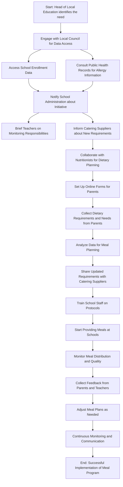





## Please review the following assumptions made based on what you've described

To tackle the goal of ensuring that children within the London Borough of Hackney have access to their entitled free school meals, here’s an expanded plan covering the key touchpoints, stakeholders, data management, and communication strategies:

### 1. **Touchpoints in the Provision of Free School Meals**

- **Schools**: Primary and secondary schools within the borough are essential touchpoints as they are where the meals will be provided and distributed.
- **Catering Suppliers**: These are the companies or services contracted to prepare and deliver meals to the schools. They play a critical role in the quality and type of meals provided.
- **Parents/Guardians**: Engagement with parents is crucial for gathering information on dietary needs and ensuring they are aware of the free meal provisions.
- **Local Education Authorities**: They oversee the implementation and monitoring of the program, ensuring that the process aligns with policies and regulations.

### 2. **Availability and Provision of Meals**

- **School Canteens**: Most schools have on-site facilities where meals are prepared or served. Understanding their current capacities and limitations will help in assessing whether additional resources or support is needed.
- **Centralized Meal Preparation**: Some schools might rely on off-site kitchens or third-party catering services to deliver meals, especially for schools without full kitchen facilities.
- **Grab-and-Go Options**: For schools with time or space constraints, pre-prepared meal options could be offered for students to pick up and consume during lunch periods.

### 3. **Key Stakeholders and Their Roles**

- **School Administration**: School principals and administrative staff need to be informed about new processes or changes in how meals are distributed.
- **Teachers**: Teachers, particularly those supervising meal times, should be briefed to help monitor and support the students’ meal experience.
- **Catering Suppliers**: The suppliers should be aware of any changes in dietary requirements, volume adjustments, and timelines to accommodate shifts in demand.
- **Nutritionists and Dietitians**: Consulting with these professionals can ensure that the meals meet dietary standards and cater to specific health needs of students.

### 4. **Data Ownership and Access**

- **Local Council Databases**: The London Borough of Hackney may have existing records on children eligible for free school meals. Collaborating with the data management department is essential to access this information.
- **School Enrollment Data**: Schools themselves might maintain records that indicate eligibility and contact information for parents/guardians.
- **Public Health Records**: Data from public health departments might provide insights into dietary requirements and allergy considerations relevant to specific schools or areas.
- **Parents/Guardians**: Collecting data directly from parents is necessary for dietary restrictions, religious requirements, and other specific needs of the children.

### 5. **Engaging with Parents for Dietary Requirements and Needs**

- **Online Surveys/Forms**: Develop user-friendly, secure online forms for parents to fill out detailing their children’s dietary needs, allergies, and preferences.
- **School Meetings and Workshops**: Host sessions either in person or virtually to inform parents about the free school meal program and discuss how they can submit their children’s dietary requirements.
- **Direct Communication**: Use emails, text messages, and school apps to remind parents to submit relevant information.
- **Feedback Mechanisms**: Establish an ongoing feedback loop where parents can report on the adequacy and quality of the meals provided and suggest adjustments based on their children’s needs.

### 6. **Additional Considerations**

- **Privacy and Data Security**: Ensure that all data collected from parents and schools is handled according to data protection laws and policies, safeguarding children’s personal information.
- **Training for Staff**: Ensure that school staff, especially those involved in meal distribution and student interaction, are trained on dietary and allergy protocols.
- **Meal Quality Checks**: Regularly monitor the quality of meals provided to ensure they meet nutritional standards and are well-received by students.
- **Communications Strategy**: Develop clear communication materials for parents, schools, and catering partners to outline the processes, the benefits of the program, and any updates or changes.

### 7. **Final Goal**

The goal is to build a streamlined and well-communicated approach that ensures every child entitled to free school meals has reliable access to nutritious, appropriate food options. This requires coordination between various stakeholders, continuous monitoring, and an emphasis on transparency and engagement with the families involved.

## Proposed action plan

{{ govukRadios({
  name: "contact",
  fieldset: {
    legend: {
      text: "Is this right?",
      isPageHeading: true
    }
  },
  items: [
    {
      text: "Yes",
      checked: true,
      disabled: true
    },
    {
      text: "No",
      disabled: true
    }
  ]
}) }}

{{ govukButton({
  text: "Create a bill of materials",
  href: "/begin/review-bill-of-materials"
}) }}
